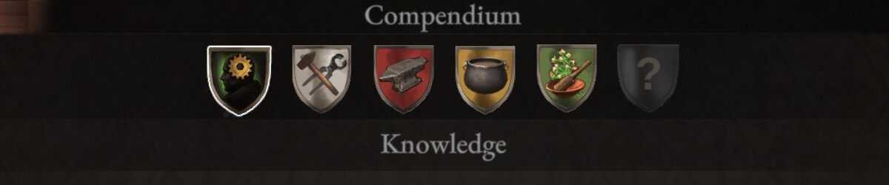

# Compendium

Wartales is an open world RPG in which you lead a group of mercenaries in their search for wealth across a massive medieval universe. Explore the world, recruit companions, collect bounties and unravel the secrets of the tombs of the ancients!

It has been a hundred years since the world saw the fall of the once great Edoran Empire at the hands of an unprecedented plague that swept the nation. In the turmoil and uncertainty that has followed, mercenary work, banditry and thievery across the land is abundant, as honor has long since become an almost entirely forgotten virtue.