# Knowledge

!!! note ""

    

    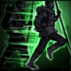{align=left}
    
     

    ### Run
    ---
    *
You can move around by running for a few seconds. The best way to elude enemies.
*
    **
Hold SHIFT to run.
**
    

!!! note ""

    

    
Requires [Run](knowledge.md#run)

    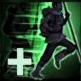{align=left}
    ### Endurance Run
    ---
    *
You can run for a longer time.
*
    **
Run duration increased by 50%
** 
    

!!! note ""

    

    {align=left}
    ### Career Plans
    ---
    *
Allows you to have enhanced control over your Companions' evolution when they level up.
*
    **
You can spend [Influence] to add 1+ to an Aptitude when levelling up.
** 
    

!!! note ""

    

    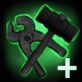{align=left}
    ### Restoration
    ---
    *
Your troop improves their armour repairing skills.
*
    **Repair materials restore 5 additional Armour point.**
    

!!! note ""

    

    
Requires [Restoration](knowledge.md#restoration)

    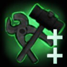{align=left}
    ### Improved Restoration
    ---
    *
Your troop improves their armour repairing skills.
*
    **Repair materials restore 5 additional Armour point.**
    

!!! note ""

    

    {align=left}
    ### Rationing
    ---
    *
Your Companions are now more sensible and ration their food.
* **
The troops eats 3 less food each day
**
    

!!! note ""

    

    {align=left}
    ### Endurance Training
    ---
    *
The troop is improving its stamina and can move faster.
*
    **Movement speed in the world increased by 5%** 	

    

!!! note ""

    

    
Requires [Endurance Training](knowledge.md#endurance_training)

    {align=left}
    ### Long Distance Running
    ---
    *
The troop is learning how to use roads and trails for quick travel.
*
    **Movement speed on the roads increased by 20%.**
    

!!! note ""

    

    {align=left}
    ### Frugality
    ---
    *
Each Companion agrees to a cut in their wage for greater good.
*
    **Wages paid to Companions reduced by 10%.** 	

    

!!! note ""

    

    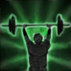{align=left}
    ### Weighted Training
    ---
    *
The troop has trained with weights and can now carry heavy loads over long distance.
*
    **[Carrying Capacity] increased by 5.** 	

    

!!! note ""

    

    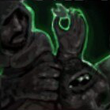{align=left}
    ### For Money!
    ---
    *
In order to find Krowns, the Companion search bodies in the most incongruous places.
*
    **[Krowns] gained after a battle increased by 5%.**
    

!!! note ""

    

    {align=left}
    ### For Glory!
    ---
    *
The troops tends to boast after beating an opponent.
*
    **[Influence] gained after a battle is increased by 5%.**
    

!!! note ""

    

    {align=left}
    ### Location Markers
    ---
    *
Your troop can add objective markers to the map.
*
    **Adding markers to the map with <Right Click>.**
    

!!! note ""

    

    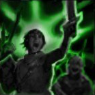{align=left}
    ### Feat Makers
    ---
    *
Your Companions are ready to fight and shine with glory on the battlefield.
*
    **Maximum [Valour Points] increased by 1.**
    

!!! note ""

    

    
Requires [Feat Makers](knowledge.md#feat_makers)

    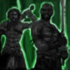{align=left}
    ### Bravest of the Braves
    ---
    *
Your troop is highly trained and ready to do anything to win. With class.
*
    **Maximum [Valour Points] increased by 1.**
    

!!! note ""

    

    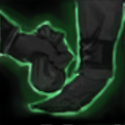{align=left}
    ### Offer Hunters
    ---
    *
Your Companions are bribing the Bounty Emissary to get more contracts.
*
    **Increases by 1 the number of Contracts displayed on the List of Bounties.**
    

!!! note ""

    

    {align=left}
    
Requires [Offer Hunters]

    ### Bountiful Bounties
    ---
    *
Your troop is improving their organizational skills and seeks to accumulate more bounties.
*
    **Increases by 1 the number of Contracts you can accept in the List of Bounties.**
    

!!! note ""

    

    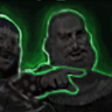{align=left}
    ### Smooth Talk
    ---
    *
Your Companions become great spokesperson who can talk anyone into joining their ranks.
*
    **[Recruitment] cost of Companions reduced by 5%.**
    

!!! note ""

    

    {align=left}
    
Requires [Smooth Talk]

    ### Fast Training
    ---
    *
Your troop knows how to welcome new recruits with care and attention.
*
    **New recruits gain 1 Aptitude Point.**
    

!!! note ""

    

    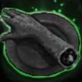{align=left}
    ### Cannibalism
    ---
    *
Your troop is prepared to do anything to survive, including eating their own.
*
    **You can now devour human corpses.**
    

!!! note ""

    

    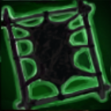{align=left}
    
Requires [Cannibalism]

    ### Miscellaneous Tanning
    ---
    *
Your Companions no longer have any qualms about treating a human like an animal.
*
    **You can now produce [Leather] from human [corpses].**
    

!!! note ""

    

    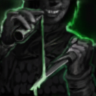{align=left}
    
Requires [Poison Vial]

    ### Poison Mastery
    ---
    *
Your Companions are learning how to use toxic plants and infectious reagents to cause the most painful death.
*
    **Increases [Poison] effectiveness (+1% of the target's HP per application).**
    

!!! note ""

    

    {align=left}
    ### Bleeding Mastery
    ---
    *
Your Companions are learning the delicate art of butchery on the battlefield.
*
    **Increases [Bleeding] effectiveness (5% of the target's HP).**
    

!!! note ""

    

    ### Burning Mastery
    ---
    *
Your troop is developing a strong taste for seared flesh.
*
    **Increases [Burning] effectiveness (+5% of the target's HP) .**
    

!!! note ""

    

    {align=left}
    ### Artful Dodgers
    ---
    *
Your Companions are honing their criminal skills and learning to master the art of stealth.
*
    **You are hunted by the Guards less often (+10% of Suspicion required).**
    

!!! note ""

    

    
Requires [Tiltren Restoration]

    {align=left}
    ### Tiltren Restoration
    ---
    *
Following Tiltren methods, your troop optimises the use of repair materials.
*
    **Repair materials restore 5 additional Armour point.**
    

!!! note ""

    

    
Requires [Gosenberg Restoration]

    {align=left}
    ### Gosenberg Restoration
    ---
    *
Following Gosenberg methods, your troop optimises the use of repair materials.
*
    **Repair materials restore 5 additional Armour point.**
    

!!! note ""

    

    
Requires [Edoranian Restoration]

    {align=left}
    ### Edoranian Restoration
    ---
    *
Following Edoranian methods, your troop optimises the use of repair materials.
*
    **Repair materials restore 5 additional Armour point.**
    

!!! note ""

    

    
Requires [Harag Restoration]

    {align=left}
    ### Harag Restoration
    ---
    *
Following Harag methods, your troop optimises the use of repair materials.
*
    **Repair materials restore 5 additional Armour point.**
    

!!! note ""

    

    
Requires [Whip]

    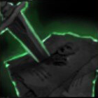{align=left}
    ### Make an Example of them!
    ---
    *
Your troop fears being whipped by too strong a hand.
*
    

