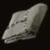
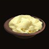
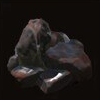
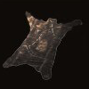
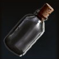
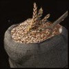
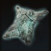
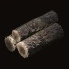

# Components

## Cloth
{align=left}

!!! note ""

    
*This cloth fabric allows you to craft clothing that will stand the test of time.*

    
Cloth is used in several [Workshop](../compendium/workshop.md), [Blacksmithing](../compendium/anvil.md), and [Apothecary](../compendium/apothecary_table.md) recipes. It can be looted from humans or purchased from certain merchants.

    
&middot; Krowns: 1 &nbsp; &middot; Weight: 0.1

## Grease
{align=left}

!!! note ""

    
*This grease can be used to make torches, quite handy for travelling in the dark.*

    
Grease is used to in making [Torches] as well as certain [Apothecary](../compendium/apothecary_table.md) recipes. It can be looted from boars, or purchased from certain merchants.

    
&middot; Krowns: 1 &nbsp; &middot; Weight: 0.1

## Iron Ore
{align=left}

!!! note ""

    
*Iron ore can be used to make weapons, armor, and abuilding components.*

    
Iron is used in several [Blacksmithing](../compendium/anvil.md) and [Workshop](../compendium/workshop.md) recipes. It can be found while exploring the open world, looted, or mined iron ore deposits in various locations.

    
&middot; Krowns: 2 &nbsp; &middot; Weight: 0.5

## Leather
{align=left}

!!! note ""

    
*This leather is used to craft weapons, armour, and armour layering.*

    
Leather is used in several [Blacksmithing](../compendium/anvil.md) and [Workshop](../compendium/workshop.md) recipes. It can be found from killing wild animals, purchased from certain merchants, and looted.

    
&middot; Krowns: 2 &nbsp; &middot; Weight: 0.5

## Vial
{align=left}

!!! note ""

    
*A small vial made of glass, used to craft medicines and alchemical items.*

    
Vials are used in several [Apothecary](../compendium/apothecary_table.md) recipes and can be purchased from the Apothecaries in towns. The vial will be kept after drinking a potion.

    
&middot; Krowns: 3 &nbsp; &middot; Weight: 0.1

## Wheat
{align=left}
!!! note ""

    
*Must be cooked before eating.*

    
Wheat is used in several cooking recipes and can be bought or looted from various locations in the world.

    
&middot; Krowns: 1 &nbsp; &middot; Weight: 0.3

## White Leather
{align=left}
!!! note ""

    
*An odd type of leather, which is exceptionally tough despite its silky texture.*

    
White Leather is primarily used in Journeyman [Blacksmithing](../compendium/anvil.md) recipes and [Armour Layers](armour_layers.md) and can be looted from [Ghost Packs] roaming in the woods at night.

    
&middot; Krowns: 2 &nbsp; &middot; Weight: 0.5

## Wood
{align=left}

!!! note ""

    
*The quintessential fuel source, wood is also useful for making boats and weapon handles.*

    
Wood is used in crafting several [Workshop](../compendium/workshop.md) and [Blacksmithing](../compendium/anvil.md) recipes. It can be found while exploring the open world, looted, or cut from woodworking logs in various locations.

    
&middot; Krowns: 2 &nbsp; &middot; Weight: 0.5
