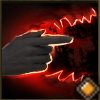

!!! note ""

    

    {align=left}
    ### ATTACK! 

    
Melee - Range 12m

    
Level 3 Archer &middot;> Beastmaster &middot; [Light Armor](../../../data/inventory/light_armor.md)

    ---
    
All allied animals next to the target attack them with an [attack of opportunity].

    
 [Skill Mastery]: ?

    
