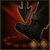

!!! note ""

    

    {align=left}
    ### Barrage 

 

    ---
    
9m area

    
Level 3 &middot;> Infantryman &middot; [Light Armor](../../../data/inventory/light_armor.md)

    
Targets a specific area. Performs an [attack of opportunity] against the 3 first enemies crossing the area.
 
    
 [Skill Mastery]: Performs an [attack of opportunity] against the 4 first enemies crossing the area.
 
    

