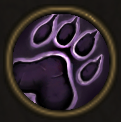

!!! note ""

    

    {align=left}
    ### Beast Mastery

    
Passive

    
Level 5 Archer

    ---
    Animals can be controlled in battle. 
    
 [Mastery] &middot;  At the end of their turn, heals allied animals for 5% of their maximum Health. 

    

