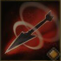

!!! note ""

    

    {align=left}
    ### Recoil Shot 

    
9m shot - [Dexterity](../../../data/companions/attributes.md#dexterity)

    
Level 3 Archer &middot;> Hunter &middot; [Light Armor](../inventory/light_armor.md)

    ---
    
Deals 40%-80% dexterity damage to the target, knocks them back by 2 meters and applies [Slowdown](../../../data/companions/status.md#slowdown) for 1 rounds.

    
 [Mastery] &middot;  Deals 50%-90% dexterity damage to the target, knocks them back by 3 meters and applies [Slowdown](../../../data/companions/status.md#slowdown) for 2 rounds.
    

    

