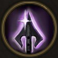

!!! note ""

    

    {align=left}
    ### Reinforced Arrows

    
Passive

    
Level 5 Archer

    ---
    Each time this unity lands a critical hit, applies [Bleeding](../../../data/companions/status.md#bleeding).
    
 [Mastery] &middot;  Critical Damage increased by 25%.

    

