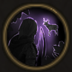

!!! note ""

    

    {align=left}
    ### Thrill of the Hunt

    
Passive

    
Level 8 Archer

    ---
    Each attack executed at a distance of more than 8m grants 1 [Rage](../../../data/companions/status.md#rage).
    

