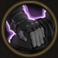

!!! note ""

    

    {align=left}
    ### Valorous Support
    ---
    
Passive

    
Level 2 Archer
 

    
Every time this unity ends their turn next to an ally and is not engaged in combat, gain 1 [Temporary Valour Point].

    

