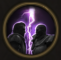

!!! note ""

    

    {align=left}
    ### One on One

    
Passive

    
Level 8 Brute

    ---
    This unit has [Rivalry] as long as there is no other unit next to them or their opponent. 
    
 [Mastery] &middot; 
    This unit has [Rivalry] as long as there is no other unit next to them.    
    

    

