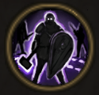

!!! note ""

    

    {align=left}
    ### Opportunism

    
Passive

    
Level 5 Brute

    ---
    As long as there are at least 2 enemies within 6m of this unit, the unit has [Protection](../../../data/companions/status.md#protection).
    
