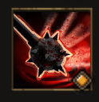

!!! note ""

    

    {align=left}
    ### Poisoned Impact 

    
2m area [Strength](../../../data/companions/attributes.md#strength)

    
Level 2 Brute &middot;> Smasher &middot; [Heavy Armor](../../../data/inventory/medium_armor.md)

    ---
    Deals damage to all the units in the area. Applies 2 [Poisons](../../../data/companions/status.md#poison) to [Bleeding](../../../data/companions/status.md#bleeding) units.
    
 [Mastery] &middot; 
    **Fatal Blow**: Leaves a Cloud of Poison on the ground.
    

    

