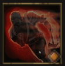

!!! note ""

    

    {align=left}
    ### Relentless Charge 

    ---
    
6m move [Strength](../../../data/companions/attributes.md#strength)

    
Level 2 Brute &middot;> Vanguard &middot; [Medium Armor](../../../data/inventory/medium_armor.md)

    Disengages and charges in a straight line. Deals damage to all units in their path and applies [Slowdown] for 1 round.
    
[Skill Mastery](index.md): ?

    

