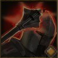

!!! note ""

    

    {align=left}
    ### Weakening Blow 

    
Melee [Strength](../../../data/companions/attributes.md#strength)

    
Level 2 Brute &middot;> Destroyer &middot; [Heavy Armor](../../../data/inventory/medium_armor.md)

    ---
    Deals damage to the target and applies [Weakening](../../../data/companions/status.md#weakening) for 3 rounds. 
    
 [Mastery] &middot; 
    If the unit already [Weakened](../../../data/companions/status.md#weakening), also applies [Vulnerability](../../../data/companions/status.md#vulnerability).
    

    

