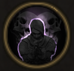

!!! note ""

    

    {align=left}
     
    ### Cold Blooded

    
    
Passive

    
Level 8 Ranger

    ---
    Damage of attacks from behind increased by 20%.

    

         
        [Skill Mastery]: ?
    
 
    

