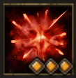

!!! note ""

    

    {align=left}
    
    

    
    ### Explosive Gas 

    
    
9m shot

    
Level 8 Ranger

    ---
    Targets a specific area. Doubles the [Poisons] of all units in the area at the start of the next turn. 

    

         
        [Skill Mastery]: ?
    
 
    

