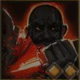

!!! note ""

    

    {align=left}
    ### Frenzy 

 

    
Melee Dexterity

    
Level 3 Ranger &middot;> Cutthroat &middot; [Light Armor](../../../data/inventory/light_armor.md)

    ---
    
Deals 15-20 damage to the target.

    
**[Ambush](../../../data/companions/status.md#ambush)**: Performs 2 additional attacks.
 
    
 [Mastery] &middot; **[Fatal Blow](../../../data/companions/status.md#fatal_blow)**: This skill can be reused in this round.
 
    

