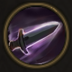

!!! note ""

    

    {align=left}
    ### Knife Throw

    
Passive - Dexterity

    
Level 5 Ranger

    ---
    After using a skill, deals 11 damage to the closest enemy within 4 meters.
    
 [Mastery] &middot; Resets the unit's [Movement](../../../data/companions/attributes.md#movement).

    

