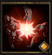

!!! note ""

    

    {align=left}
    
    

    
    ### Low blow

    
    
2m area

    
Level 8 Ranger

    ---
    Applies [Blackout] to all enemies in the area.

    

         
        [Skill Mastery]: ?
    
 
    

