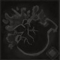

!!! note ""

    

    {align=left}
    ### Poison Vial 

    
9m area

    
Level 3 Ranger &middot;> Poisoner &middot; [Light Armor](../../../data/inventory/light_armor.md)

    ---    
    
Applies 3 [Poisons](../../../data/companions/status.md#poison) to all units in the area.
 
    
 [Mastery] &middot; Applies [Vulnerability](../../../data/companions/status.md#vulnerability) to those who are already [Poisoned](../../../data/companions/status.md#poison).
 
    

