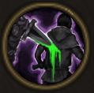

!!! note ""

    

    {align=left}
    ### Poisoned Weapon

    
Passive

    
Level 5 Ranger

    ---
    Every time this unit attacks from behind, they apply 2 [Poisons](../../../data/companions/status.md#poison).
    
 [Mastery] &middot; The [Poison](../../../data/companions/status.md#poison) applied spreads to enemies next to the target.

    

