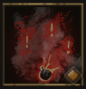

!!! note ""

    

    {align=left}
    ### Smoke Screen 

    
10m area

    
Level 3 Ranger &middot;> Strategist &middot; [Light Armor](../../../data/inventory/light_armor.md)

    ---    
    
Forces enemies engaged in the area to disengage. They incur an [attack of opportunity] from their opponent.

    
 [Mastery] &middot; Enemies that are not engaged in combat are Knocked Back by 2m.
 
    

