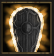

!!! note ""

    

    {align=left}
    ### Defensive Stance
    
Instant / Base Action

    
Level 3 Brute, Swordsman, Warrior

    ---

    The unit gains [Deflection](../../../data/companions/status.md#deflection). If they are engaged in combat, you gain 1 [Temporary Valour Point].
    
