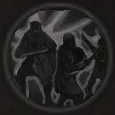

!!! note ""

    

    {align=left}
    ### Valorous Audacity
    
Passive

    
Level 2 Archer, Ranger, Spearman
 
    ---
    Every time this unity ends their turn next to an enemy and is not engaged in combat, gain 1 [Temporary Valour Point].
    

