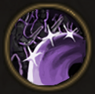

!!! note ""

    

    {align=left}
    ### Valorous Chain
    
Passive

    
Level 3 Brute, Swordsman, Warrior

    ---

    Every time an attack hits several enemies, you gain 1 [Temporary Valour Point].
    
