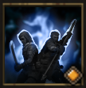

!!! note ""

    

    {align=left}
    
    

    
    ### Last Push 
    
    
Melee

    
Level 8 &middot; Spearman

    ---

    Applies to this unit and the targetted ally as many [Rage] as they have Debuffs.

    

         
        [Skill Mastery]: ?
    
 
    

