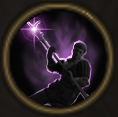

!!! note ""

    

    {align=left}
    ### Preparedness
    
Passive

    
Level 8 &middot; Spearman

    ---

    If this unit ends their turn while not engaged in combat, they gain [Fury].
    

