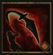

!!! note ""

    

    {align=left}
    ### Spear Throw 

    
8m area - Strength

    
Level 3 &middot;  Spearman &middot;> Harpooner &middot; [Medium Armor](../../../data/inventory/medium_armor.md)

    ---
    
Deals 20 damage to all units in the area. Applies [Bleeding](../../../data/companions/status.md#bleeding) to the first unit hit.
 
    
 [Skill Mastery]: Applies [Bleeding](../../../data/companions/status.md#bleeding) to all units hit.
 
    

