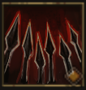

!!! note ""

    

    {align=left}
    ### Spear Wall 

    
3m area - Strength

    
Level 3 &middot; Spearman &middot;> Pikeman &middot; [Medium Armor](../../../data/inventory/medium_armor.md)

    ---
    
Targets a specific area. When an enemy enters the area, performs 1 [attack of opportunity] and stops them in their tracks.
 
    
 [Skill Mastery]: ?
 
    
