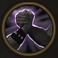

!!! note ""

    

    {align=left}
    ### Team Spirit
    
Passive

    
Level 5 &middot; Spearman

    ---

    While next to an ally, this unit has [Brutality](../../../data/companions/status.md#brutality).
    
 [Mastery] &middot; As long as this unit is next to an ally, they both have [Brutality](../../../data/companions/status.md#brutality).
 

    

