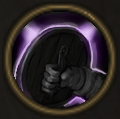

!!! note ""

    

    {align=left}
    ### Bulwark
    
Passive

    
Level 5 &middot; Swordsman

    ---

    Each time this unit engages, they gain [Deflection](../../../data/companions/status.md#deflection).
    
 [Mastery] &middot; Every time they disengage, they gain [Fury](../../../data/companions/status.md#fury).
 
    

