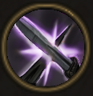

!!! note ""

    

    {align=left}
    ### Counter-Attack
    
Passive

    
Level 5 &middot; Swordsman

    ---

    Each time this unit engages, they gain [Riposte](../../../data/companions/status.md#riposte).
    
 [Mastery] &middot; Every time they disengage, they gain [Inspiration](../../../data/companions/status.md#inspiration) for 1 round.
 
    

