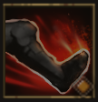

!!! note ""

    

    {align=left}
    ### Destabilizing Strike 

    
6m area

    
Level 2 Swordsman &middot;> Fighter &middot; [Heavy Armor](../../../data/inventory/heavy_armor.md)

    ---
    
    Deals strength damage to the target and applies [Destabilization] for 2 rounds.
    
 [Skill Mastery]: ?
 
    

