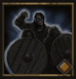

!!! note ""

    

    {align=left}
    ### Encouragement 

    
6m area

    
Level 2 Swordsman &middot;> Protector &middot; [Heavy Armor](../../../data/inventory/heavy_armor.md)

    ---
    
    The unit and all allies in the area gain [Protection](../../../data/companions/status.md#protection) for 2 rounds.
    
 [Mastery] &middot; [Protection](../../../data/companions/status.md#protection) lasts for 3 rounds.
 
    

