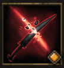

!!! note ""

    

    {align=left}
    
    

    
    ### Hand-to-Hand Combat 
    
    
Melee

    
Level 8 Swordsman

    ---

    Applies [Disarm] to the target for 1 round.

    

         
        [Skill Mastery]: ?
    
 
    

