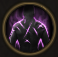

!!! note ""

    

    {align=left}
    ### Hardcore Training
    
Passive

    
Level 8 &middot; Swordsman

    ---

    This unit is immune to [Bleeding], [Poison], or [Burning].
    

         
        [Mastery] &middot; When they should be affected by these effects, they gain 2 [Rage](../../../data/companions/status.md#rage) instead (once per effect per round).
    
 
    

