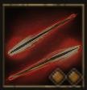

!!! note ""

    

    {align=left}
    ### Laceration 

    
6m area

    
Level 2 Swordsman &middot;> Swordmaster &middot; [Medium Armor](../../../data/inventory/medium_armor.md)

    ---
    Deals strength damage to all the units in the area 2 times. Usable after 2 attacks.
    
 [Mastery] &middot; Usable after 1 attack.
 
    

