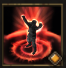

!!! note ""

    

    {align=left}
    
    

    
    ### Challenging Shout 
    
    
3m area

    
Level 8 Warrior

    ---

    Draws within melee range all the enemies in the area. Applies [Fragility] for 1 round to the enemies disengaged by this.

    

         
        [Skill Mastery]: ?
    
 
    

