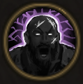

!!! note ""

    

    {align=left}
    ### Fanaticism
    
Passive

    
Level 5 &middot; Warrior

    ---

    At the end of their turn, this unit loses 10% of their maximum Health to gain [Fury].
    

