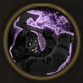

!!! note ""

    

    {align=left}
    ### Madness
    
Passive

    
Level 5 &middot; Warrior

    ---

    Damage increased by 50% against units with 30% health or less.
    
 [Mastery]: Damage increased by 50% against units with 50% health or less. 
 
    

