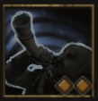

!!! note ""

    

    {align=left}
    

    ### Ovation 
    
Instant

    
Level 2 Warrior &middot;> Sentinel &middot; [Heavy Armor](../../../data/inventory/heavy_armor.md)

    ---
    
    All allies engaged in combat gain [Riposte].
    
 [Skill Mastery]: ?
 
    

