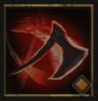

!!! note ""

    

    {align=left}
    

    ### Rampage 
    
Melee - Strength

    
Level 2 Warrior &middot;> Berserker &middot; [Medium Armor](../../../data/inventory/medium_armor.md)

    ---
    
    Deals 3 times more 30-40% strength damage to the target.
    
Critical Hit: Gains [Fury].

    
 [Mastery] &middot; Ignores [Guard].
 
    

